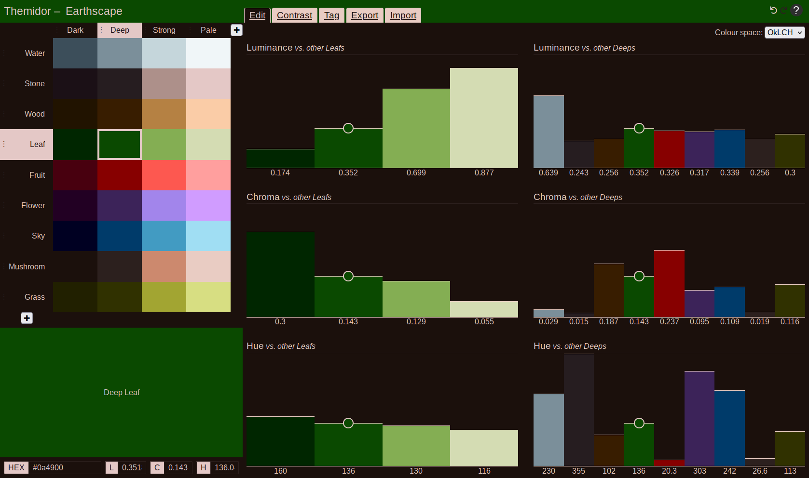

# Themidor

A tool for creating colour palettes and themes.

Try it now at https://themidor.cc

## Features

- Edit colours in OKLch, HSL and sRGB colour spaces.
- Check the WCAG contrast of your colours against eachother.
- Tag your colours to assign them roles, and export your colour theme in various formats:
  - Base24
  - CSS Variables
  - Dunst
  - Fuzzel
  - Ghostty
  - Niri
  - Rxvt-unicode
  - Noctalia
  - Custom Liquid template
  - More to come!
  - Need a format that's not implemented? Create an issue (or better yet, a pull request)!

## Thanks

Themidor was inspired by many other tools, but particularly by [CIELab.io](https://cielab.io) and [terminal.sexy](https://terminal.sexy). 